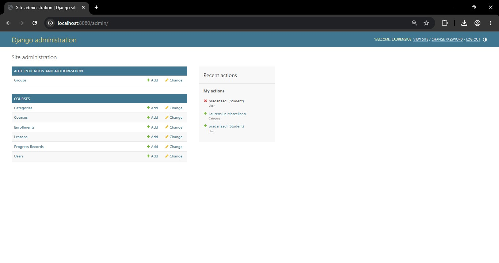
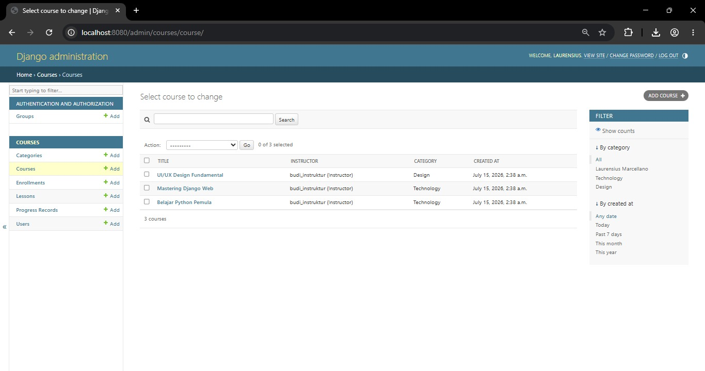
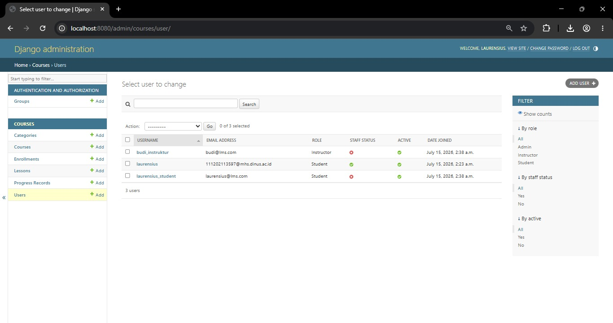
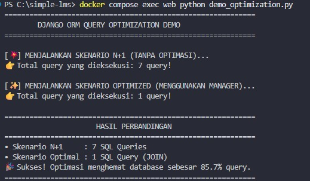

# Progress 2: Simple LMS - Database Design & ORM Implementation

Proyek backend website Learning Management System (LMS) sederhana yang dibangun menggunakan Django (Python) dan PostgreSQL, dikemas secara penuh menggunakan Docker untuk memudahkan proses *development*.

---

## Dokumentasi






## 🛠️ Prasyarat Sistem & Cara Menjalankan

Aplikasi ini berjalan sepenuhnya di atas kontainerisasi Docker. Pastikan perangkat lunak **Docker Desktop** sudah aktif di komputer Anda, lalu jalankan rangkaian perintah berikut melalui terminal:

```bash
# 1. Bangun dan jalankan service web beserta PostgreSQL di latar belakang
docker compose up -d --build

# 2. Sinkronisasikan skema tabel basis data
docker compose exec web python manage.py migrate

# 3. Suntikkan paket data awal fiktif (Fixtures)
docker compose exec web python manage.py loaddata initial_data

# 4. Buat akun akses utama panel kontrol
docker compose exec web python manage.py createsuperuser

### Akses Aplikasi
http://localhost:8080
