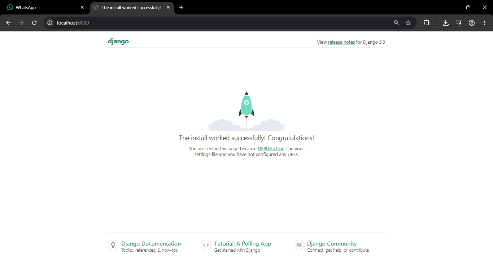

# Progress 1: Simple LMS (Learning Management System) - Docker & Django Foundation

Proyek backend website Learning Management System (LMS) sederhana yang dibangun menggunakan Django (Python) dan PostgreSQL, dikemas secara penuh menggunakan Docker untuk memudahkan proses *development*.

---

## 📸 Screenshot Django Welcome Page


## 🚀 Cara Menjalankan Project

Ikuti langkah-langkah berikut untuk menjalankan proyek ini di komputer lokal Anda:

### 1. Prasyarat
Pastikan Anda sudah menginstal:
* [Docker Desktop](https://www.docker.com/products/docker-desktop/)
* [Visual Studio Code](https://code.visualstudio.com/)

### 2. Setup Environment File
Salin file template `.env.example` menjadi `.env` di direktori utama:
```bash
cp .env.example .env

### Build dan Jalankan Kontainer
docker compose up --build -d

### Untuk menghentikan semua layanan
docker compose down

### Migrasi Database
docker compose exec web python manage.py migrate

### Akses Aplikasi
http://localhost:8080